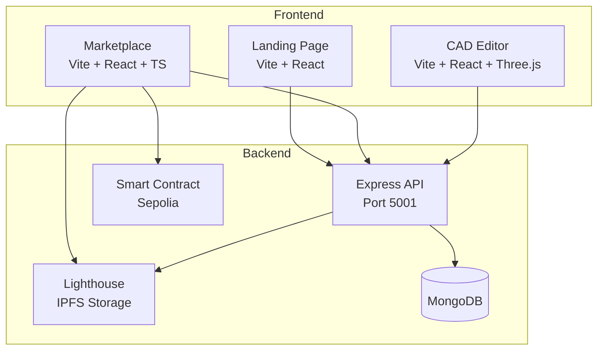

# ChainTorque

### _Web3 Engineering Platform with Browser-Based CAD Editor_

> **ChainTorque** revolutionizes 3D model platforms by combining blockchain technology, professional CAD tools, and real-time 3D interaction to create a secure, transparent, and intelligent platform for engineering assets.

## 🚀 **What is ChainTorque?**

ChainTorque is a comprehensive Web3 platform that solves critical problems in the 3D engineering space:

- **🛡️ NFT-Based Licensing**: Blockchain-verified ownership and licensing
- **🎮 Interactive 3D Previews**: Inspect models before purchasing
- **🎨 Browser-Based CAD Editor**: Professional 2D sketching + 3D modeling with OpenCascade.js
- **🌐 Decentralized Storage**: IPFS integration via Lighthouse for censorship resistance
- **💰 Direct Creator Payments**: 97.5% to seller, 2.5% platform fee via smart contracts

## 🏗️ **Project Structure**

```
ChainTorque/
├── Landing Page (Frontend)/     # Vite + React marketing site (Port 5000)
├── Marketplace (Frontend)/      # Vite + React + TypeScript NFT marketplace (Port 8080)
├── CAD (Frontend)/              # Vite + React CAD editor with OpenCascade.js (Port 3001)
├── ChainTorque_Native/          # Android app - Kotlin + Jetpack Compose
└── backend/                     # Express API + Hardhat Smart Contracts (Port 5001)
```

## 🛠️ **Technologies Used**

| Layer | Technologies |
|-------|--------------|
| **Runtime** | Bun (3x faster than Node.js) |
| **Frontend** | React 18, Vite, Three.js, @react-three/fiber, Tailwind CSS |
| **CAD Engine** | OpenCascade.js (WASM), Three.js, Custom 2D Canvas |
| **Android** | Kotlin, Jetpack Compose, Hilt DI, MetaMask SDK |
| **Backend** | Express, MongoDB, IPFS (Lighthouse SDK) |
| **Blockchain** | Solidity (ERC-721), Hardhat, Ethereum Sepolia, ethers.js |
| **Auth** | Clerk (Web3 wallet + social login) |
| **Deployment** | Render.com (4 services) |

## 🎨 **CAD Editor Features**

The browser-based CAD editor (`CAD (Frontend)/`) provides:

### 2D Sketching Tools
- **Line Tool** (L): Draw connected line segments
- **Polygon Tool** (P): Create closed polygon shapes
- **Circle Tool** (C): Draw circles with center + radius
- **Grid Snap**: Automatic alignment to grid
- **Undo/Redo**: Backspace to undo, full history support

### 3D Modeling
- **Sketch Extrusion**: Convert 2D sketches to 3D solids via OpenCascade.js
- **Real-time Preview**: Three.js powered 3D viewport with orbit controls
- **View Controls**: Front, Top, Right, Isometric camera presets
- **2D/3D Toggle**: Seamless switching between sketch and model modes

### CAD Kernel
- **OpenCascade.js**: Industry-standard BREP geometry kernel (WASM)
- **Primitives**: Box, Cylinder, Sphere creation
- **Boolean Operations**: Union, Cut, Intersection
- **Memory Managed**: Proper cleanup of WASM objects

### Keyboard Shortcuts
| Key | Action |
|-----|--------|
| L | Line tool |
| P | Polygon tool |
| C | Circle tool |
| I | Toggle 3D view |
| Enter | Save sketch |
| ESC | Cancel/Back to 2D |
| Backspace | Undo last point |
| Arrow Keys | Pan canvas |
| Scroll | Zoom |

## 🚀 **Quick Start**

### Prerequisites
Install [Bun](https://bun.sh) - a fast all-in-one JavaScript runtime:
```sh
# Windows (PowerShell)
powershell -c "irm bun.sh/install.ps1|iex"

# macOS/Linux
curl -fsSL https://bun.sh/install | bash
```

### Installation & Running
```sh
# Clone and install
git clone https://github.com/Dealer-09/Chain-Torque.git
cd Chain-Torque
bun install

# Start all services (Landing, Marketplace, Backend, CAD)
bun run dev

# Or run individual services
bun run dev:landing      # Landing page (Port 5000)
bun run dev:marketplace  # Marketplace (Port 8080)
bun run dev:backend      # Backend API (Port 5001)
bun run dev:cad          # CAD editor (Port 3001)
```

## 🗺️ **Development Status**

### ✅ Completed
- [x] Bun monorepo with npm workspaces
- [x] 3D marketplace with NFT minting & purchasing
- [x] Decentralized purchase flow (MetaMask → Smart Contract → IPFS)
- [x] ETH payments: 97.5% to seller, 2.5% platform fee
- [x] Smart contract deployed on Sepolia testnet
- [x] IPFS storage via Lighthouse SDK
- [x] Search & category filtering
- [x] Purchased items with download links
- [x] Dashboard with user stats
- [x] Clerk authentication integration
- [x] **CAD Editor with OpenCascade.js**
  - [x] 2D Canvas with Line, Polygon, Circle tools
  - [x] Grid snap and pan/zoom controls
  - [x] Sketch extrusion to 3D solids
  - [x] Three.js 3D viewport with camera controls
  - [x] Feature Tree with visibility/delete
  - [x] Production build optimized
- [x] Render.com deployment (all 4 services)
- [x] **Native Android App** (ChainTorque_Native)
  - [x] Jetpack Compose UI with Material 3
  - [x] Native Wallet Integration (MetaMask SDK)
  - [x] NFT marketplace browsing & purchasing
  - [x] User profiles and transaction history

### 🔄 In Progress
- [ ] AI Assistant "Torquy" for CAD commands
- [ ] Relist/resale functionality
- [ ] Save/Load CAD projects

### 📋 Planned
- [ ] STL/GLB export from CAD editor
- [ ] User profile pages
- [ ] Multi-chain support (Polygon)
- [ ] AR/VR model preview

## 🏗️ **Architecture**



## 🔒 **Environment Variables**

Create `.env` in the project root:
```env
# MongoDB
MONGODB_URI=mongodb+srv://...

# Ethereum
RPC_URL=https://sepolia.infura.io/v3/...
PRIVATE_KEY=your_wallet_private_key
CONTRACT_ADDRESS=0x...

# Clerk Auth
VITE_CLERK_PUBLISHABLE_KEY=pk_...
CLERK_SECRET_KEY=sk_...

# IPFS (Lighthouse)
LIGHTHOUSE_API_KEY=...
```

## 🤝 **Contributing**

We welcome contributions! Areas of focus:

- **🎨 CAD Features**: Enhance 2D/3D tools, add new primitives
- **🤖 AI Integration**: Implement Torquy AI assistant
- **🔧 Blockchain**: Smart contract optimization, multi-chain
- **📝 Documentation**: API docs, tutorials

## 📄 **License**

MIT License - see [LICENSE](LICENSE) for details.

---

<div align="center">

**🔗⚙️ Building the Future of Engineering, One Block at a Time**

[](#quick-start)
[](#cad-editor-features)
[](#contributing)

</div>
